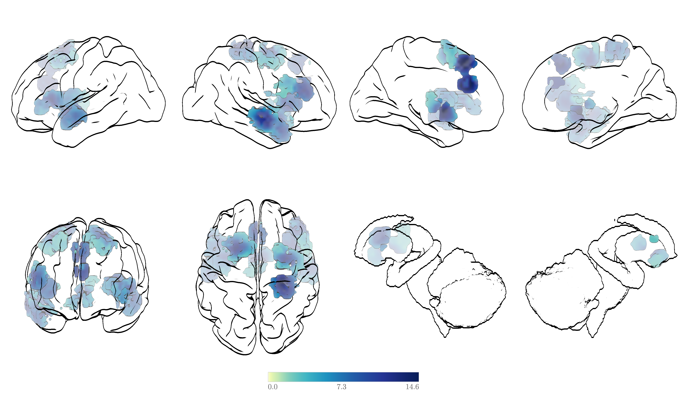

# Glass Brains 2.0

Interactive 3D **glass-brain** viewer and **headless figure renderer** for
volumetric neuroimaging statistics, with a clean cel-shaded aesthetic: a
translucent fresnel cortex, opaque self-occluding stat voxels, live-threshold
silhouette edges, and a depth "veil" that fades deep voxels toward white.

The Python side turns a NIfTI stat map + fsaverage surfaces into GLB meshes and
a `scene.json`; a config-driven Three.js viewer renders multi-panel brain views
either **interactively in the browser** or **headlessly to a PNG** (one config
drives both, so figures match the interactive view pixel-for-pixel).



---

## Features

- **One config, two renderers** — the same declarative config drives the
  interactive browser viewer and the headless PNG renderer.
- **Multiple overlays** — load several NIfTIs at once; each gets its own control
  row (colormap, threshold, cluster, veil, …). **Row order = draw priority**: the
  top row is drawn on top where overlays overlap. Add with **`+ NIfTI`**, remove
  with **✕**.
- **Fully customisable layouts** — any grid of any anatomical views
  (`left_lateral`, `right_medial`, `dorsal`/`axial`, `anterior`/`frontal`,
  subcortical close-ups, …), 2×2 to N×M, from the CLI.
- **Statistical controls** — voxelwise threshold, **cluster-extent threshold**
  (drop clusters below *k* voxels), positive-only.
- **Faithful colour** — the full `cmap` colormap catalogue, auto
  sequential-vs-diverging selection, and a positive-data washout guard; an
  on-screen colorbar (one per overlay) runs the *same* shader pipeline so it
  matches the voxels.
- **Blocky or smooth** voxels, pial or inflated cortex.
- **Shared world scale** so every brain renders at the same physical size across
  a figure, plus **per-panel zoom** (hover a panel for `+ / –`).
- **Save-PNG** — a high-res, print-tuned capture (thinner lines, more spacing)
  of the current view.
- **Comic SFX** — because brains rendered like comic panels deserve the
  occasional *BOOM!* (toggle the **Kapow** checkbox).

---

## Install

```bash
git clone https://github.com/gregetarian/comicbrains
cd comicbrains
pip install -e .

# For headless figure rendering (glass-brains render):
pip install -e ".[render]"
python -m playwright install chromium
```

The first run fetches the `fsaverage` template via MNE
(`mne.datasets.fetch_fsaverage`) and caches it under `~/mne_data/`.

---

## Quickstart

### Python API

```python
from glass_brains import GlassBrain

gb = GlassBrain()                      # fsaverage cortex + subcortical structures
gb.add_overlay("zstat.nii.gz", threshold=2.3)
gb.show()                              # builds assets, serves, opens the browser

# Several maps at once — first added is the TOP row (drawn on top):
gb = GlassBrain()
gb.add_overlay("contrast_A.nii.gz")
gb.add_overlay("contrast_B.nii.gz")
gb.show()
```

### Command line

```bash
# Interactive viewer (one or more NIfTIs; first = top row)
glass-brains show contrast_A.nii.gz contrast_B.nii.gz

# Headless figure → PNG (default: 9-panel, YlGnBu, smooth voxels)
glass-brains render zstat.nii.gz -o figure.png

# Custom layout: L/R lateral on top, axial + frontal on the bottom
glass-brains render zstat.nii.gz -o figure.png \
    --grid 2x2 --views left_lateral,right_lateral,axial,frontal \
    --cmap YlGnBu -k 100 --width 1600 --height 1000
```

---

## The interactive viewer

The control bar is split into a **global surface row** and **one row per loaded
NIfTI**. Every slider has a type-in box and a hover tooltip.

**Surface row (applies to the whole figure):**

- **`+ NIfTI`** — load one or more stat maps; each appends a new overlay row.
- **layout** — switch 4-panel ↔ 9-panel.
- **Save PNG** — high-res, print-tuned capture (thinner lines, more inter-panel
  spacing than the on-screen view).
- **Inflate / Outline** — inflated vs pial cortex; black silhouette on/off.
- **cortex α / edge thr / line w** — cortex glass opacity, sulcal-line density, line width.
- **Light: direct / ambient** — scene lighting (off by default; voxel colour
  comes from emissive + a light-independent glint).

**Per-overlay row (one per NIfTI):**

- name + **✕** to remove · **colormap** · **Smooth** (blocky↔smooth) ·
  **thr** (threshold) · **cluster k** (cluster-extent) · **+only** ·
  **Edges** + **edge w** · **veil / veil log** (depth fade) ·
  **emissive / specular / shine**.
- **Row order = display priority** — drag-free: the higher row wins where
  overlays overlap.

**On the panels themselves:**

- **Hover a panel** → a small **`+ / –`** appears top-left to rescale just that view.
- **Kapow** (top-right checkbox) → comic SFX on click, for fun.

## CLI reference

`glass-brains render` is fully parameterised — `--grid RxC`, `--views ...`
(row-major; `_` = blank cell; aliases like `axial=dorsal`, `frontal=anterior`),
plus style flags: `--surface`, `--voxels`, `--cmap`, `-k/--cluster-size`,
`--threshold`, `--veil`, `--veil-k`, `--emissive`, `--specular`, `--shininess`,
`--directional`, `--ambient`, `--cortex-alpha`, `--edge-thr`, `--line-w`,
`--voxel-edge-w`, `--margin`, `--colorbar/--no-colorbar`, `--colorbar-font`,
`--colorbar-fontsize`, `--shadows/--no-shadows`, `--positive-only`,
`--no-edges`, `--no-outline`, `--no-subcortical`, and output `--width`,
`--height`, `--scale`. Run `glass-brains render -h` for the full list.

---

## How it works

See [METHODS.md](METHODS.md) for the full pipeline: surface/subcortical
extraction and MNI305→MNI152 alignment, per-structure voxel meshing (blocky
exposed-face quads + smooth marching-cubes), colormap normalisation and the
washout guard, connected-component cluster sizing, and the Three.js render
pipeline (fresnel glass, opaque depth-veiled voxels, light-independent glint,
depth-edge silhouette passes, headless Playwright capture).

```
glass_brains/
  core.py          GlassBrain API + `show`/`render` CLI
  surfaces.py      fsaverage cortex load + inflation
  subcortical.py   subcortical/cerebellar surface extraction
  overlays.py      stat-map → per-structure voxel/smooth meshes, cluster sizes
  colormaps.py     cmap → JSON LUTs for the viewer
  export.py        GLB + scene.json writers
  render.py        headless layout builder + Playwright PNG renderer
  server.py        dev server (live NIfTI upload)
  viewer/          config-driven Three.js viewer
    core/          pure, unit-tested geometry/visibility/colour (node --test)
    scene/         three.js materials, passes, renderer
    controls/      UI bindings (surface + per-overlay rows), colorbar, comic SFX
    app/           browser + headless entry points
  viewer/kapow/    comic SFX images
```

(The `glass-brains show` server lets you add/remove NIfTIs live; `render` is a
self-contained headless figure renderer.)

## Development

```bash
# Pure-core JS unit tests (no browser needed)
cd glass_brains/viewer && node --test

# Generate a tiny synthetic test volume
python make_test_sphere.py        # writes test_sphere.nii.gz
```

---

## License

MIT — see [LICENSE](LICENSE).
