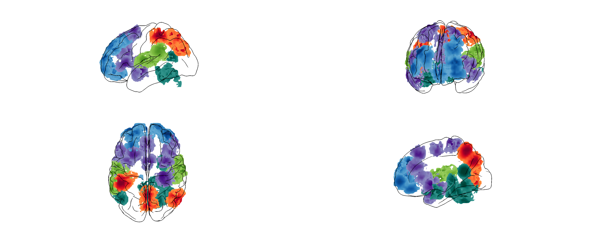

# Glass Brains 2.0

A **volumetric** glass-brain viewer + headless figure renderer for 3D neuroimaging
results — **clusters, statistical blobs, parcellations** — in **MNI152 space**, with a
cel-shaded comic aesthetic: a translucent fresnel cortex, opaque self-occluding stat
voxels, live-threshold silhouette edges, and a depth "veil" that fades deep voxels
toward white. It renders **the volume itself** (voxel cubes or marching-cubes
isosurfaces) — not a cortical-surface projection.

### ▶ Try it in your browser (no install): **https://gregetarian.github.io/comicbrains/**
Drag in a NIfTI and it renders — the whole pipeline runs client-side via Pyodide, no backend.

**Plot multiple volumes at once, each with its own colormap and colorbar** — overlay
several clusters / contrasts / network clades in one figure (top row drawn on top).

One Python pipeline turns a NIfTI stat map into per-structure geometry; a single
config-driven Three.js viewer renders multi-panel views **interactively in the browser**
(locally or on GitHub Pages — meshing client-side via Pyodide) or **headlessly to a PNG**
(`glass-brains render`, same pipeline in-process) — so the figure matches the interactive
view pixel-for-pixel.



---

## Features

- **Volumetric** — plots the 3D volume directly (per-structure voxel cubes, or smooth
  marching-cubes isosurfaces of the supra-threshold blobs); great for clusters / ICA or
  network components / parcels. Not a surface (cortical-projection) renderer.
- **One config, two renderers** — the same declarative config drives the
  interactive browser viewer and the headless PNG renderer.
- **Multiple volumes at once, distinct colorbars** — load several NIfTIs; each gets its
  own control row **and its own colormap + colorbar**. **Row order = draw priority**: the
  top row draws on top where overlays overlap. Add with **`+ NIfTI`**, remove with **✕**.
- **Fully customisable layouts** — any grid of any anatomical views
  (`left_lateral`, `right_medial`, `dorsal`/`axial`, `anterior`/`frontal`,
  subcortical close-ups, …), 2×2 to N×M, from the CLI.
- **Statistical controls** — voxelwise threshold, **cluster-extent threshold**
  (drop clusters below *k* voxels), positive-only.
- **Faithful colour** — the full `cmap` colormap catalogue, auto
  sequential-vs-diverging selection, and a positive-data washout guard; an
  on-screen colorbar (one per overlay) runs the *same* shader pipeline so it
  matches the voxels. **Show/hide** the colorbars (the `✕` on them, or the
  **Colorbar** toggle) so a stack of bars never squashes the brains.
- **Blocky or smooth** voxels, pial or inflated cortex; an optional **`smooth+`** pass
  (size-preserving Laplacian) that rounds rough cluster surfaces — most visible on
  large/irregular blobs.
- **Clickable help on every control** — tap a parameter's label (above its slider) or
  the small **ⓘ** next to a toggle for a one-line explanation.
- **Shared world scale** so every brain renders at the same physical size across
  a figure, plus **per-panel zoom** (hover a panel for `+ / –`).
- **Save brain** / **Save bars** — the brains export at full resolution with no
  colorbars (never squashed); the colorbars export as a separate legend image you
  place yourself.
- **Comic SFX** — because brains rendered like comic panels deserve the
  occasional *BOOM!* (toggle the **Kapow** checkbox).

---

## Install

```bash
git clone https://github.com/gregetarian/comicbrains
cd comicbrains
pip install -e .                 # runtime: nibabel/numpy/scipy/scikit-image (the pipeline)

# Headless figure rendering (glass-brains render):
pip install -e ".[render]"
python -m playwright install chromium

# Only to RE-BAKE the fsaverage template (glass-brains bake) — most users never need this:
pip install -e ".[bake]"         # adds trimesh/mne/cmap
```

The fsaverage template is **pre-baked** and committed under `glass_brains/web/data/`,
so normal use needs no `mne`/fsaverage download — only `glass-brains bake` fetches
fsaverage via MNE (cached under `~/mne_data/`).

---

## Quickstart

```bash
# Interactive viewer — serves the local site + opens the browser. Drag NIfTIs in;
# they're meshed in-browser via Pyodide (identical to the GitHub Pages site).
glass-brains open

# Headless figure → PNG (default: 9-panel, YlGnBu, smooth voxels). Writes a clean
# full-size brain PNG + a separate <out>_colorbars.png legend.
glass-brains render zstat.nii.gz -o figure.png

# Custom layout: L/R lateral on top, axial + frontal on the bottom; extra smoothing.
glass-brains render zstat.nii.gz -o figure.png \
    --grid 2x2 --views left_lateral,right_lateral,axial,frontal \
    --cmap YlGnBu -k 100 --smooth 6 --width 1600 --height 1000

# Re-bake the fsaverage template assets into web/data/ (one-time; needs the [bake] extra)
glass-brains bake
```

> **Hosted:** the same viewer is a static site at `glass_brains/web/`, deployed to
> GitHub Pages — upload a NIfTI in the browser, no install required.

---

## The interactive viewer

The control bar is split into a **global surface row** and **one row per loaded
NIfTI**. Every slider has a type-in box; **tap a parameter's label (or the ⓘ next to a
toggle) for a one-line explanation.**

**Surface row (applies to the whole figure):**

- **`+ NIfTI`** — load one or more stat maps (meshed in-browser via Pyodide; the first
  upload fetches the ~30 MB scientific stack once). Each appends a new overlay row.
- **Copy CLI** — copy a `glass-brains render` command that reproduces the current view.
- **layout** — switch 4-panel / 9-panel / overview.
- **Save brain** — high-res, print-tuned capture of the brains only (no colorbars,
  full canvas — never squashed by a stack of bars).
- **Save bars** — the colorbars on their own as a separate legend image.
- **Colorbar** — show/hide the on-screen colorbars (also the `✕` on the bars).
- **Inflate / Outline** — inflated vs pial cortex; black silhouette on/off.
- **cortex α / edge thr / line w** — cortex glass opacity, sulcal-line density, line width.
- **Light: direct / ambient** — scene lighting (off by default; voxel colour
  comes from emissive + a light-independent glint).

**Per-overlay row (one per NIfTI):**

- name + **✕** to remove · **colormap** (own colorbar) · **Smooth** (blocky↔smooth) ·
  **thr** (threshold) · **cluster k** (cluster-extent) · **smooth+** (size-preserving
  surface smoothing of the smooth mesh; 0 = off) · **+only** ·
  **Edges** + **edge w** · **veil / veil log** (depth fade) ·
  **emissive / specular / shine**.
- **Row order = display priority** — drag-free: the higher row wins where
  overlays overlap.

**On the panels themselves:**

- **Hover a panel** → a small **`+ / –`** appears top-left to rescale just that view.
- **Kapow** (top-right checkbox) → comic SFX on click, for fun.

## CLI reference

`glass-brains render` is fully parameterised — `--grid RxC`, `--views ...`
(row-major; `_` = blank cell; aliases like `axial=dorsal`, `frontal=anterior`),
plus style flags: `--surface`, `--voxels`, `--smooth` (extra surface smoothing),
`--cmap`, `-k/--cluster-size`, `--threshold`, `--veil`, `--veil-k`, `--emissive`, `--specular`, `--shininess`,
`--directional`, `--ambient`, `--cortex-alpha`, `--edge-thr`, `--line-w`,
`--voxel-edge-w`, `--margin`, `--colorbar/--no-colorbar`, `--colorbar-font`,
`--colorbar-fontsize`, `--shadows/--no-shadows`, `--positive-only`,
`--no-edges`, `--no-outline`, `--no-subcortical`, and output `--width`,
`--height`, `--scale`. Run `glass-brains render -h` for the full list.

---

## Scope & limitations

- **MNI152 space only.** The fsaverage cortex/subcortical template and the voxel→region
  classification assume your map is in **MNI152**. A map in another space (native,
  MNI305, fsaverage surface, etc.) will mis-place or classify to nothing.
- **3D volumes only.** Input must be a **3D** NIfTI stat/label map (not a 4D timeseries,
  not a `.gii`/surface overlay). Upload a thresholded statistic or cluster/label volume.
- **Volumetric, not surface rendering.** It draws the *volume* (voxel cubes or
  marching-cubes isosurfaces of the blobs) inside a glass brain — it does **not** project
  values onto a cortical surface mesh (no inflated-surface vertex overlays).
- **Template is fixed (fsaverage).** No per-subject anatomy; the glass shell + subcortical
  structures are the group template, baked once.
- **First browser upload downloads ~30 MB** (the Pyodide scientific stack) before the
  first map renders; cached afterwards. The bundled demo renders instantly with no download.

---

## How it works

See [METHODS.md](METHODS.md) for the full pipeline: surface/subcortical
extraction and MNI305→MNI152 alignment, per-structure voxel meshing (blocky
exposed-face quads + smooth marching-cubes), colormap normalisation and the
washout guard, connected-component cluster sizing, and the Three.js render
pipeline (fresnel glass, opaque depth-veiled voxels, light-independent glint,
depth-edge silhouette passes, headless Playwright capture).

```
glass_brains/
  pipeline.py      THE backend: NIfTI → per-structure geometry ARRAYS. Pure
                   numpy/scipy/scikit-image/nibabel — the SAME file runs in CPython
                   (CLI) and in Pyodide (browser, a byte-identical copy in web/pyodide/).
  arrays.py        write a processed overlay as one .bin + bufferLayout (for the CLI render)
  core.py          GlassBrain (template loader for the bake) + `open`/`bake`/`render` CLI
  render.py        headless layout builder + Playwright PNG renderer (in-process pipeline)
  bake.py          one-time fsaverage template bake → web/data/ (needs the [bake] extra)
  surfaces.py / subcortical.py / colormaps.py / export.py   bake-only (mne/trimesh/cmap)
  web/             THE single Three.js viewer — served by Pages, by `glass-brains open`,
                   and shipped in the wheel:
    index.html · app/main.js (one shell; ?headless=1 for render)
    core/          pure, unit-tested geometry/visibility/colour (node --test)
    scene/         materials, passes, renderer, asset-loader (GLB template + array overlays)
    controls/      UI bindings, colorbar, Copy-CLI, comic SFX
    pyodide/       bootstrap.js + pipeline.py (copy of glass_brains/pipeline.py)
    data/          baked template (cortex/subcortical GLB, colormaps, aseg) + demo + nibabel wheel
```

**One backend, one renderer, three ways to run it.** `glass_brains/pipeline.py` is the
only per-upload meshing code; `glass_brains/web/` is the only viewer. They power:
`glass-brains render` (headless PNG, pipeline in-process), `glass-brains open` (local
interactive — serves `web/`, meshing in-browser via Pyodide), and the GitHub Pages site
(the same `web/`). The fixed fsaverage template is baked once (`glass-brains bake`) and
committed under `web/data/`.

## Development

```bash
# Pure-core JS unit tests (no browser needed)
cd glass_brains/web && node --test

# Python + headless-browser tests (Playwright):
python tests/test_pipeline_parity.py   # CPython pipeline == browser ground truth
python tests/test_cli_arrays.py        # render uses array overlays, not GLB
python tests/test_pyodide_sync.py      # web/pyodide/pipeline.py == glass_brains/pipeline.py
python tests/test_smoothing.py         # smooth+ moves vertices, scales, restores, preserves aValue
python tests/smoketest.py              # Pyodide boots + meshes the demo in a browser
python tests/integration_test.py       # full app: demo, upload, preset switch, remove
```

> `glass-brains open` serves `web/` and opens it; `render`/`bake` are the headless +
> asset-bake commands. The fsaverage download (`bake`) and figure rendering (`render`)
> need the `[bake]` / `[render]` extras respectively.

---

## License

MIT — see [LICENSE](LICENSE).
