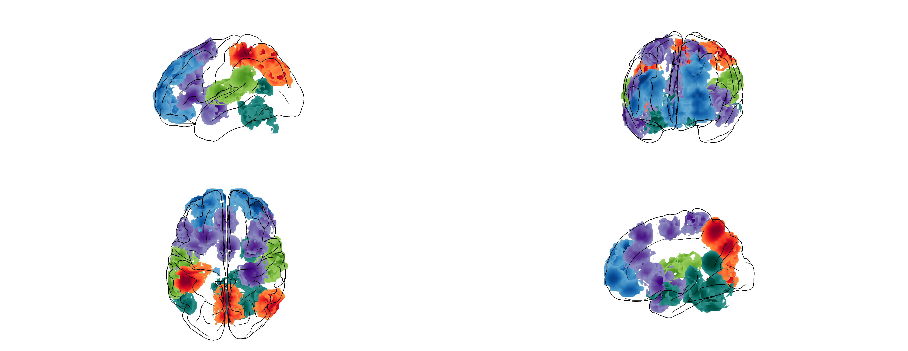

# COMIC

**Compose three-dimensional brain figures in your browser.**

## [Open COMIC](https://gregetarian.github.io/comic/)

Drop in a 3D NIfTI volume, an fsaverage surface map, or a table containing one
value per cortical parcel. COMIC processes the data locally in your browser and
does not upload them to a server. Nothing needs to be installed for ordinary use.



## What it does

- Draws volumetric results as exposed voxel faces or smooth isosurfaces, or
  samples them onto pial, white or inflated cortical surfaces.
- Loads native fsaverage GIFTI, MGH, MGZ and morphometry maps.
- Paints CSV or TSV parcel values onto the cortex with atlas boundaries.
- Combines several independently styled overlays, each with its own colourmap,
  threshold, colour limits, transparency and legend.
- Arranges, rotates, resizes, overlaps and cuts brain panels on a free canvas.
- Exports high-resolution PNG figures, separate colour bars, animated GIFs and a
  reusable `figure.json` display recipe.

COMIC is intended for already-computed human neuroimaging results. It is a figure
composer, not an analysis, registration or surface-statistics package.

## Make a figure

1. Open the [hosted viewer](https://gregetarian.github.io/comic/).
2. Drop in your data, or click **Demo**.
3. Choose the views, surfaces, colours and thresholds.
4. Export with **Save brain**, **Save bars** or **GIF**.

The first use downloads the application, template assets and scientific Python runtime.
Your input maps are processed on your computer.

## Reproduce it later

The viewer's **Copy CLI** button downloads `figure.json`, which records the layout,
cameras, cuts, surfaces, colours, thresholds and output size. Keep that file beside
the original input maps and a pinned COMIC release or commit.

For scripted or batch rendering, install the optional renderer from a checkout:

```bash
git clone https://github.com/gregetarian/comic
cd comic
python -m pip install -e ".[render]"
python -m playwright install chromium

comic render zstat.nii.gz --spec figure.json -o figure.png
```

The command-line and Python interfaces use the same Three.js application in a
headless Chromium process. Playwright and its separate Chromium download are required.
A Python API is also available for notebooks and in-memory nibabel images.

See the [usage guide](docs/usage.md) for CLI and Python examples, supported inputs,
batch rendering, local serving and troubleshooting.

## Important limits

- The hosted volume workflow expects 3D maps aligned to MNI152. COMIC warns about
  obvious mismatches but does not register data.
- Bundled anatomy is a group template, not participant-specific anatomy.
- Surface projection, smoothing and cut slabs are display operations, not analyses.
- WebGL output can vary slightly between browsers and graphics backends.

Custom aligned templates and volume-only rendering are available through the
command-line and Python interfaces.

## Documentation

- [Using COMIC](docs/usage.md)
- [Publication figures and colour scales](docs/publication-figures.md)
- [Reusing `figure.json`](docs/reusing-figure-json.md)
- [Methods and implementation](METHODS.md)
- [Contributing](CONTRIBUTING.md)
- [Preparing a release and archive](docs/release-preparation.md)

COMIC is original open-source software released under the [MIT License](LICENSE).
Bundled third-party software and data retain the terms recorded in
[NOTICE.md](NOTICE.md). Citation metadata are provided in
[CITATION.cff](CITATION.cff).

COMIC is free and always will be. If it saved you an afternoon of fiddling with
figures, you can [buy me a coffee](https://buymeacoffee.com/semilanceata).
